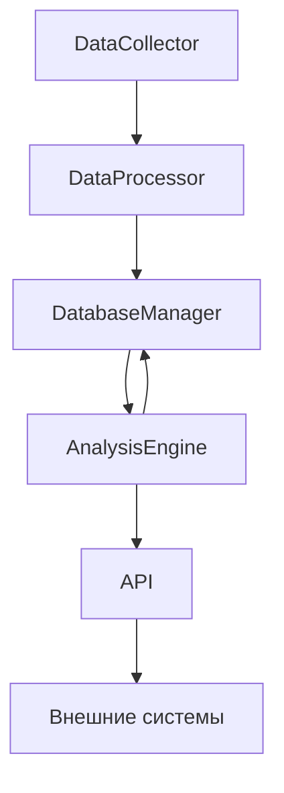

# Архитектура скрипта анализа причин изменения курса биткоина

## 1. Основные компоненты

### 1.1 DataCollector (Сборщик данных)
- Отвечает за сбор данных из различных источников
- Подкомпоненты:
  * `CryptoExchangeCollector` - сбор данных с криптобирж
  * `NewsCollector` - сбор новостей
  * `SocialMediaCollector` - сбор данных из соцсетей
  * `MacroEconomicCollector` - сбор макроэкономических показателей
  * `TechnicalIndicatorsCollector` - сбор технических индикаторов

### 1.2 DataProcessor (Обработчик данных)
- Обрабатывает и нормализует собранные данные
- Подкомпоненты:
  * `PriceChangeDetector` - определение значительных изменений цены
  * `EventCategorizer` - категоризация событий
  * `SentimentAnalyzer` - анализ настроений
  * `CorrelationAnalyzer` - анализ корреляций

### 1.3 DatabaseManager (Менеджер базы данных)
- Управляет хранением и извлечением данных
- Подкомпоненты:
  * `ConnectionManager` - управление подключениями
  * `QueryBuilder` - построение SQL-запросов
  * `DataValidator` - валидация данных

### 1.4 AnalysisEngine (Движок анализа)
- Выполняет основной анализ данных
- Подкомпоненты:
  * `PatternRecognizer` - распознавание паттернов
  * `ImpactEvaluator` - оценка влияния факторов
  * `PredictionModel` - модель прогнозирования

### 1.5 API (Интерфейс прикладного программирования)
- Предоставляет доступ к результатам анализа
- Подкомпоненты:
  * `DataEndpoint` - эндпоинты для данных
  * `AnalysisEndpoint` - эндпоинты для результатов анализа
  * `MonitoringEndpoint` - эндпоинты для мониторинга

## 2. Взаимодействие компонентов

## 3. Поток данных

1. `DataCollector` собирает данные из всех источников
2. `DataProcessor` обрабатывает и нормализует данные
3. `DatabaseManager` сохраняет обработанные данные
4. `AnalysisEngine` анализирует данные и генерирует результаты
5. Результаты сохраняются через `DatabaseManager`
6. `API` предоставляет доступ к результатам

## 4. Конфигурация

### 4.1 Основные настройки
- Периодичность сбора данных
- Пороговые значения для определения значимых изменений
- Параметры подключения к базе данных
- Настройки API ключей

### 4.2 Настройки компонентов
- Параметры анализа настроений
- Настройки технических индикаторов
- Параметры корреляционного анализа

## 5. Обработка ошибок

### 5.1 Уровни обработки
- Уровень сбора данных
- Уровень обработки
- Уровень хранения
- Уровень анализа

### 5.2 Стратегии восстановления
- Повторные попытки при сбоях
- Резервные источники данных
- Кэширование результатов

## 6. Мониторинг

### 6.1 Метрики
- Время сбора данных
- Время обработки
- Точность анализа
- Использование ресурсов

### 6.2 Логирование
- События сбора данных
- Ошибки обработки
- Результаты анализа
- Системные события 