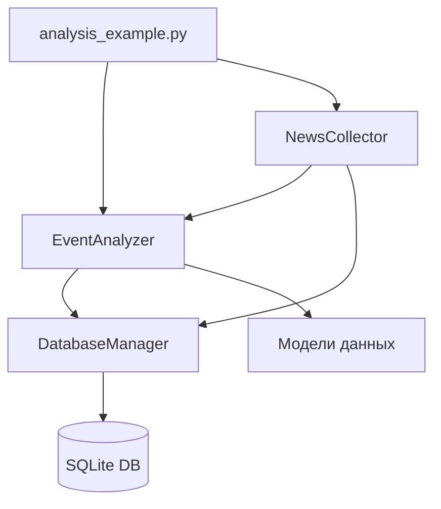

# Архитектура системы анализа причин изменения курса биткоина

## 1. Основные компоненты

### 1.1 EventAnalyzer (Анализатор событий)
- Отвечает за анализ причин изменения цены
- Основные функции:
  * Поиск релевантных событий
  * Анализ временных корреляций
  * Оценка влияния событий
  * Ранжирование причин
- Расположение: `src/analysis/event_analyzer.py`

### 1.2 NewsCollector (Сборщик новостей)
- Отвечает за сбор новостей из различных источников
- Основные функции:
  * Сбор новостей из CryptoCompare API
  * Фильтрация новостей по временному периоду
  * Преобразование новостей в события
- Расположение: `src/analysis/news_collector.py`

### 1.3 DatabaseManager (Менеджер базы данных)
- Управляет хранением и извлечением данных
- Основные функции:
  * Сохранение изменений цены
  * Сохранение событий
  * Сохранение корреляций
  * Получение исторических данных
- Расположение: `src/database/db_manager.py`

### 1.4 Модели данных
- `PriceChange`: информация об изменении цены
- `Event`: информация о событии
- `EventPriceCorrelation`: корреляция между событием и изменением цены
- Расположение: `src/models/`

### 1.5 Примеры использования
- `analysis_example.py`: пример использования системы для анализа причин изменения цены
- Расположение: `src/analysis_example.py`

## 2. Взаимодействие компонентов



## 3. Поток данных

1. `NewsCollector` получает новости из внешних источников
2. Новости преобразуются в события и сохраняются в БД
3. `EventAnalyzer` получает данные о событиях и изменении цены
4. Анализирует временные корреляции и влияние событий
5. `DatabaseManager` сохраняет результаты в базу данных
6. Результаты выводятся в консоль

## 4. Конфигурация

### 4.1 Основные настройки (config/config.yaml)
- Параметры анализа:
  * Целевая дата
  * Порог изменения цены
  * Окно анализа
- Настройки базы данных:
  * Тип БД (SQLite)
  * Путь к файлу БД
- Настройки логирования:
  * Уровень логирования
  * Формат логов
  * Файл логов
- Настройки источников новостей:
  * API ключи
  * Включенные источники

## 5. Обработка ошибок

### 5.1 Уровни обработки
- Уровень базы данных:
  * Обработка ошибок подключения
  * Транзакции и откаты
- Уровень анализа:
  * Валидация входных данных
  * Обработка исключений при анализе
- Уровень сбора новостей:
  * Обработка ошибок API
  * Валидация данных новостей

### 5.2 Логирование
- Использование loguru для логирования
- Запись в файл и консоль
- Разные уровни логирования (INFO, ERROR, DEBUG)

## 6. Расширяемость

### 6.1 Точки расширения
- Добавление новых источников новостей
- Реализация новых методов анализа
- Интеграция с внешними API

### 6.2 Планы развития
- Интеграция с API криптобирж
- Добавление технического анализа
- Реализация REST API
- Визуализация результатов

## 7. Структура проекта

```
.
├── config/             # Конфигурационные файлы
├── data/              # Данные и результаты анализа
├── src/               # Исходный код
│   ├── analysis/      # Модули анализа
│   │   ├── event_analyzer.py
│   │   └── news_collector.py
│   ├── database/      # Работа с БД
│   │   ├── db_manager.py
│   │   └── init_db.py
│   ├── models/        # Модели данных
│   ├── scripts/       # Вспомогательные скрипты
│   └── analysis_example.py
├── .venv/             # Виртуальное окружение
├── requirements.txt   # Зависимости проекта
└── architecture.md    # Документация по архитектуре
``` 