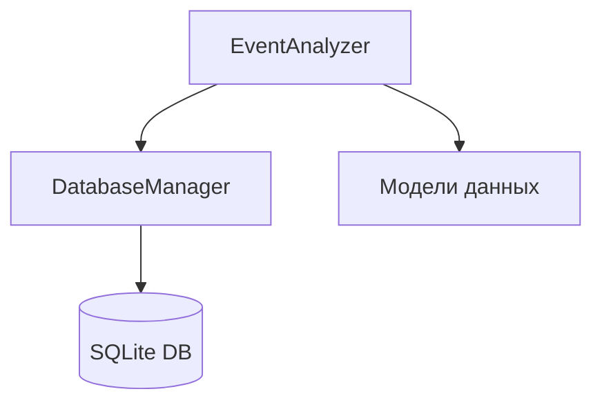

# Архитектура системы анализа причин изменения курса биткоина

## 1. Основные компоненты

### 1.1 EventAnalyzer (Анализатор событий)
- Отвечает за анализ причин изменения цены
- Основные функции:
  * Поиск релевантных событий
  * Анализ временных корреляций
  * Оценка влияния событий
  * Ранжирование причин

### 1.2 DatabaseManager (Менеджер базы данных)
- Управляет хранением и извлечением данных
- Основные функции:
  * Сохранение изменений цены
  * Сохранение событий
  * Сохранение корреляций
  * Получение исторических данных

### 1.3 Модели данных
- `PriceChange`: информация об изменении цены
- `Event`: информация о событии
- `EventPriceCorrelation`: корреляция между событием и изменением цены

## 2. Взаимодействие компонентов

## 3. Поток данных

1. `EventAnalyzer` получает данные о событиях и изменении цены
2. Анализирует временные корреляции и влияние событий
3. `DatabaseManager` сохраняет результаты в базу данных
4. Результаты выводятся в консоль

## 4. Конфигурация

### 4.1 Основные настройки (config.yaml)
- Параметры анализа:
  * Целевая дата
  * Порог изменения цены
  * Окно анализа
- Настройки базы данных:
  * Тип БД (SQLite)
  * Путь к файлу БД
- Настройки логирования:
  * Уровень логирования
  * Формат логов
  * Файл логов

## 5. Обработка ошибок

### 5.1 Уровни обработки
- Уровень базы данных:
  * Обработка ошибок подключения
  * Транзакции и откаты
- Уровень анализа:
  * Валидация входных данных
  * Обработка исключений при анализе

### 5.2 Логирование
- Использование loguru для логирования
- Запись в файл и консоль
- Разные уровни логирования (INFO, ERROR)

## 6. Расширяемость

### 6.1 Точки расширения
- Добавление новых типов событий
- Реализация новых методов анализа
- Интеграция с внешними API

### 6.2 Планы развития
- Интеграция с API криптобирж
- Добавление технического анализа
- Реализация REST API
- Визуализация результатов 